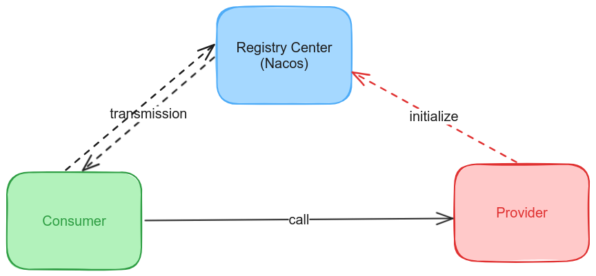

# mini-rpc
## 介绍
mini-rpc是基于Nacos + Netty实现的RPC框架。在网络传输方面分别实现了Java原生的Sockt和Netty版本，并且实现了多种序列化方式和负载均衡算法。
> 使用Socket进行网络传输是BIO通信模式，使用Netyy进行网络传输是NIO通信模式 


## 项目模块说明
```text
mini-rpc -- 项目根路径
├── rpc-api -- 服务接口
├── rpc-common -- 存放一些公用的实体、枚举、工具类等
├── rpc-common -- rpc框架核心实现
├── test-client -- 客户端测试示例
├── test-server -- 服务端测试示例
```
## 技术栈
* Netty框架
* Nacos
* 序列化器
  * JSON 序列化
  * Kryo 序列化
  * Hessian 序列化
  * Protostuff 序列化
* slf4j 日志库
* guava 工具库
* Lombok 工具库
## 功能
* 实现了Socket传输和Netty传输两种网络传输方式
* 基于模板设计模式实现了随机和轮询两种负载均衡算法
* 实现了Json、Kryo、Hessian、Protostuff四种不同的序列化方式，实现了Gzip和Zlib两种压缩算法,在传输过程种实现数据压缩，减少网络数据传输量，提高传输效率
* 使用Nacos作为服务注册中心，管理服务提供者的信息
* 采用Netty作为网络传输方式的时候，会采用Netty的心跳机制，保证客户端和服务端的连接不被断掉，避免重连
* 实现了自定义的通信协议
* 实现了服务提供端主动注册服务
* 集成 Spring 通过注解注册服务
* 处理一个接口有多个类实现的情况 ：对服务分组，发布服务的时候增加一个 group 参数即可
## 使用
**定义调用接口**
```java
public interface HelloService {
    String hello(HelloObject object);
}
```
**服务提供端**
实现接口：
```java
@Service
public class HelloServiceImpl implements HelloService {
    private static final Logger LOGGER = LoggerFactory.getLogger(HelloServiceImpl.class);

    @Override
    public String hello(HelloObject object) {
        LOGGER.info("接收到消息：{}", object.getMessage());
        return "这是Hello方法";
    }
}
```
启动服务提供端：
```java
@ServiceScan
public class NettyTestServer {
  public static void main(String[] args) {
    AnnotationConfigApplicationContext applicationContext = new AnnotationConfigApplicationContext(NettyServer.class);
    NettyServer nettyServer = (NettyServer) applicationContext.getBean("nettyServer");
    nettyServer.registerService();
    nettyServer.start();
  }
}
```
**服务消费端**
```java
public class NettyTestClient {
  public static void main(String[] args) {
    RpcClient client = new NettyClient(CommonSerializer.PROTOBUF_SERIALIZER);
    RpcClientProxy rpcClientProxy = new RpcClientProxy(client, new RpcServiceConfig("Group1", HelloService.class));
    HelloService helloService = rpcClientProxy.getProxy(HelloService.class);
    HelloObject object = new HelloObject(12, "this is a message");
    String res = helloService.hello(object);
    System.out.println(res);
  }
}
```
> 运行项目需要启动Nacos

本项目的核心目标是通过亲手实现一个框架的过程，来深入学习框架开发的技术和方法